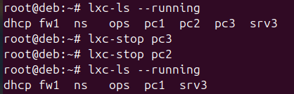

# TP4 - Nicolas MARRA (3A - RIO)


## - Introduction 

Après avoir téléchargé la machine virtuelle, je me suis connecté sur la machine ops via ssh, avec la commande suivante : 

```bash 
ssh tprli@192.168.57.98
```


j'ai testé l'accès à GLPI via l'url suivante: 

http://192.168.57.98/glpi/ (identifiant : glpi/tprli)


Pour avoir l'internet sur la machine ops, j'ai utilisé les règles iptables suivantes : 

```bash
iptables -P FORWARD ACCEPT
iptables -t nat -A POSTROUTING -s 10.0.0.0/24 -j MASQUERADE  
iptables -t nat -A POSTROUTING -s 192.168.56.0/24 -j MASQUERADE  
iptables -t nat -A POSTROUTING -s 192.168.57.0/24 -j MASQUERADE  

echo 1 > /proc/sys/net/ipv4/ip_forward
```

## - Installation de l'agent fusioninventory

Dans cette partie, j'ai utilisé un playbook ansible pour le déploiement (installation de paquet, configuration) sur les 3 pcs.

Tout d'abord, j'ai paramétré ansible sur home/tprli/.ansible.cfg pour ignorer les clés machines et utiliser root comme login de connexion ssh, avec les commandes suivantes : 

```cfg
[defaults]
host_key_checking = False
remote_user = root
inventory = /home/tprli/hosts
```

Ensuite, j'ai créé un inventaire nommé inventory.ini contenant donc les pc1, pc2 et pc3: 

```ini
[pcs]
pc1
pc2
pc3
```


Après avoir créé l'inventaire, j'ai déployé l'agent fusion (paquet "fusioninventory-agent"), en paramétrant l'agent (fichier /etc/fusioninventory/agent.cfg) et indiquant l'url de l'API fusion inventory du serveur GLPI, après l'agent s'exécute sur la machine : fusioninventory-agent
Les commandes ont été précisées sur le fichier fusioninventory.yml : 

```yml
- name: Déployer l'agent FusionInventory
  hosts: pcs
  become: true
  tasks:
  - name: Mettre à jour le système de chaque pc
    command: apt update --allow-releaseinfo-change
    
  - name: Installer le paquet FusionInventory-agent
    package:
      name: fusioninventory-agent
      state: present
  - name: Configurer l'agent FusionInventory
    lineinfile:
     path: /etc/fusioninventory/agent.cfg
     regex: '^server'
     line: 'server = http://192.168.57.98/glpi/plugins/fusioninventory/'
  - name: Exécuter l'agent FusionInventory
    command: fusioninventory-agent
```

Une fois tout paramétré, j'ai lancé le playbook avec la commande suivante : 

```bash
ansible-playbook -i inventory.ini fusioninventory.yml
```

Pourque que cela marche, j'ai du me connecter à chaque pc et faire `apt-update`. 
J'ai pu vérifier que les machines et leur configuration ont été ajoutées dans l'inventaire GLPI via l'url suivante : 

```bash
http://192.168.57.98/glpi/plugins/fusioninventory/front/menu.php
```


## - Utilisation de l'API de GLPI


Dans cette partie, je vais utiliser l'API propser par GLPI pour accéder aux données de l'inventaire. 
L'accès à cette API se fait en deux étapes :
  - Authentification
  - Requête à l'API

Un script en python sera écrit pour réalise ces deux étapes afin de renvoyer la liste de tous les ordinateurs de la base d'inventaire.

Tout d'abord, un client API doit être créé afin d'obtenir la clé APPTOKEN qui permet de faire l'authentification et d'accéder à l'API. 

Le client api a généré le token suivant : 
```bash
utIjN6j9JMsPiaqsfUOFd4xyH5H4OsTlMICriKnZ
```

Ce token sera utilisé comme clé pour s'authentifier, il faudra utiliser aussi le nom d'utilisateur (glpi) et le mot de passe (tprli) utilisé pour se connecter sur le dashboard GLPI.


Le script suivant permet de s'authentifier à l'API et de récupérer la liste de tous les ordinateurs de l'inventaire. 

```python
import requests
import base64

user = "glpi"
password = "tprli"
APPTOKEN = "utIjN6j9JMsPiaqsfUOFd4xyH5H4OsTlMICriKnZ"
APIURL = "http://192.168.57.98/glpi/apirest.php"

# 1- Authentification
auth_token = base64.b64encode(f"{user}:{password}".encode('utf-8')).decode('utf-8')

headers = {
    'Content-Type': 'application/json',
    'Authorization': f'Basic {auth_token}',
    'App-Token': APPTOKEN
}

response = requests.get(f"{APIURL}/initSession", headers=headers)

if response.status_code == 200:
    session_token = response.json().get('session_token')
else:
    print(f"Erreur d'authentification : {response.status_code}")
    exit()

# 2- Récupérer la liste des ordinateurs
headers = {
    'Content-Type': 'application/json',
    'Session-Token': session_token,
    'App-Token': APPTOKEN
}

response = requests.get(f"{APIURL}/Computer", headers=headers)

if response.status_code == 200:
    computers = response.json()
    print("Liste des ordinateurs récupérée: ")
    
    for computer in computers:
        print(computer.get('name'))
else:
    print(f"Erreur de récupération des ordinateurs : {response.status_code}")

```


## - Inventaire dynamique

Dans cette partie, j'ai modifié le script précédant pour qu'il joue le rôle d'in script d'inventaire, l'API de GLPI doit servir de source d'inventaire à Ansible. 

J'ai modifié le code afin qu'il produise la sortie suivante, comptabile avec Ansible :

voici le code modifié : 

```python 
import requests
import base64
import json

user = "glpi"
password = "tprli"
APPTOKEN = "utIjN6j9JMsPiaqsfUOFd4xyH5H4OsTlMICriKnZ"
APIURL = "http://192.168.57.98/glpi/apirest.php"

# 1- Authentification
auth_token = base64.b64encode(f"{user}:{password}".encode('utf-8')).decode('utf-8')

headers = {
    'Content-Type': 'application/json',
    'Authorization': f'Basic {auth_token}',
    'App-Token': APPTOKEN
}

response = requests.get(f"{APIURL}/initSession", headers=headers)

if response.status_code == 200:
    session_token = response.json().get('session_token')   
else:
    print(f"Erreur d'authentification : {response.status_code}")
    exit()

# 2- Récupérer la liste des ordinateurs
headers = {
    'Content-Type': 'application/json',
    'Session-Token': session_token,
    'App-Token': APPTOKEN
}

response = requests.get(f"{APIURL}/Computer", headers=headers)

if response.status_code == 200:
    computers = response.json()
    inventory = {
        "all": {
            "hosts": [computer.get('name') for computer in computers]
        }
    }
    
    print(json.dumps(inventory, indent=4))
else:
    print(f"Erreur de récupération des ordinateurs : {response.status_code}")
```


Malheureusement j'ai dû faire ce script en shell, car je n'arrivais pas à installer pip sur la machine ops.

J'ai donc transformé ce script en shell : 

```sh
#!/bin/sh

USER="glpi"
PASSWORD="tprli"
APPTOKEN="utIjN6j9JMsPiaqsfUOFd4xyH5H4OsTlMICriKnZ"
APIURL="http://localhost/glpi/apirest.php"

# 1- Authentification
AUTH_TOKEN=$(echo -n "$USER:$PASSWORD" | base64)

response=$(curl -s -w "%{http_code}" -o response.json -X GET "$APIURL/initSession" \
  -H "Content-Type: application/json" \
  -H "Authorization: Basic $AUTH_TOKEN" \
  -H "App-Token: $APPTOKEN")

if [ "$response" -eq 200 ]; then
  session_token=$(jq -r '.session_token' response.json)
else
  echo "Erreur d'authentification : $response"
  exit 1
fi

# 2- Requete pour récupérer les ordinateurs
response=$(curl -s -w "%{http_code}" -o response.json -X GET "$APIURL/Computer" \
  -H "Content-Type: application/json" \
  -H "Session-Token: $session_token" \
  -H "App-Token: $APPTOKEN")

if [ "$response" -eq 200 ]; then
  computers=$(jq -r '.[].name' response.json)
  
  inventory="{\"all\": {\"hosts\": ["
  
  first=1
  for computer in $computers; do
    if [ $first -eq 1 ]; then
      first=0
    else
      inventory="$inventory,"
    fi
    inventory="$inventory\"$computer\""
  done

  inventory="$inventory]}}"
  
  echo "$inventory" | jq .
else
  echo "Erreur de récupération des ordinateurs : $response"
  exit 1
fi
```

Ensuite j'ai ajouté les permissions d'exécution pour le script :

```bash
chmod +x script_ansible.sh
```

Juste après, je l'ai testé avec la commande suivante :

```bash
ansible -i script_ansible.sh -m ping all
pc3 | SUCCESS => {
    "changed": false,
    "ping": "pong"
}
pc1 | SUCCESS => {
    "changed": false,
    "ping": "pong"
}
pc2 | SUCCESS => {
    "changed": false,
    "ping": "pong"
}
```


## - Supervision avec Nagios

Dans cette partie, le but est de surveiller les machines à l'aide de Nagios qui a été pré-installé sur la machine ops.

Je dois donc créer un fichier pc.cfg dans etc/nagios4/objects pour toutes les machines de l'inventaire au format suivant : 

```cfg
define host{
 use linux-server
 host_name pc1
 check_interval 1
 }
 ```

 Pour ce faire, j'ai repris mon script précédent afin qu'il soit capable de génerer le fichier cfg pour toutes les machines.

 J'ai créé donc le script suivant :

 ```bash
 #!/bin/sh

USER="glpi"
PASSWORD="tprli"
APPTOKEN="utIjN6j9JMsPiaqsfUOFd4xyH5H4OsTlMICriKnZ"
APIURL="http://192.168.57.98/glpi/apirest.php"

# 1- Authentification
AUTH_TOKEN=$(echo -n "$USER:$PASSWORD" | base64)

response=$(curl -s -w "%{http_code}" -o response.json -X GET "$APIURL/initSession" \
  -H "Content-Type: application/json" \
  -H "Authorization: Basic $AUTH_TOKEN" \
  -H "App-Token: $APPTOKEN")

if [ "$response" -eq 200 ]; then
  session_token=$(jq -r '.session_token' response.json)
else
  echo "Erreur d'authentification : $response"
  exit 1
fi

# 2- Requete pour récupérer les ordinateurs
response=$(curl -s -w "%{http_code}" -o response.json -X GET "$APIURL/Computer" \
  -H "Content-Type: application/json" \
  -H "Session-Token: $session_token" \
  -H "App-Token: $APPTOKEN")

if [ "$response" -eq 200 ]; then
  computers=$(jq -r '.[].name' response.json)
  
  inventory="{\"all\": {\"hosts\": ["
  
  first=1
  for computer in $computers; do
    if [ $first -eq 1 ]; then
      first=0
    else
      inventory="$inventory,"
    fi
    inventory="$inventory\"$computer\""

    # 3- Création du fichier de configuration Nagios pour chaque machine
    config_file="/etc/nagios4/objects/pc.cfg"

    echo "define host{" >> "$config_file"
    echo "    use linux-server" >> "$config_file"
    echo "    host_name $computer" >> "$config_file"
    echo "    check_interval 1" >> "$config_file"
    echo "}" >> "$config_file"
    
  done

  inventory="$inventory]}}"
  
  echo "$inventory" | jq .
else
  echo "Erreur de récupération des ordinateurs : $response"
  exit 1
fi
```

Ce script créé le fichier pc.cfg dans le /etc/nagios4/objects, le fichier contient donc toutes les machines.


Ensuite, j'ai activé le fichier créé par le script (pc.cfg) en l'ajoutant dans les fichiers de configuration chargés par Nagios.


J'ai ajouté les lignes suivantes dans le fichier /etc/nagios4/nagios.cfg  : 

```bash
#Definitions for monitoring our pcs 
cfg_file=/etc/nagios4/objects/pc.cfg
```

Ensuite, j'ai relancé le service nagios, avec la commande suivante :

```bash
sudo systemctl restart nagios4
```

On peut voir que les machines sont visibles sur la liste des hosts de l'interface de Nagios.


Afin de vérifier si la détection de changement d'état dans Nagios se passe bien, j'ai arrête les machines suivantes : pc2 et pc3.

```bash
root@deb:~# lxc-ls --running
dhcp fw1  ns   ops  pc1  pc2  pc3  srv3 
root@deb:~# lxc-stop pc3
root@deb:~# lxc-stop pc2
root@deb:~# lxc-ls --running
dhcp fw1  ns   ops  pc1  srv3 
```



Depuis l'interface de Nagios, on peut voir que les machines pc2 et pc3 sont détectées comme DOWN.


J'ai relancé ces deux machines et on peut voir qu'elles sont à nouveau détectées comme ON:

```bash
root@deb:~# lxc-start pc3
root@deb:~# lxc-start pc2
root@deb:~# lxc-ls --running
dhcp fw1  ns   ops  pc1  pc2  pc3  srv3 
```


## - Check Nagios

Dans cette partie, on doit ajouter un service permettant de vérifier si SMTP fonctionne sur localhost, la machine ops, à l'aide de la commande check_smtp.

Afin de faire cela, j'ai ajouté une commande dans le fichier de configuration des commandes Nagios (/etc/nagios4/objects/commands.cfg)  : 

```bash
define command{
	command_name check_smtp
	command_line /usr/lib/nagios/plugins/check_smtp -H $HOSTADRESS$$
}
```


En fait, pour superviser un élément sur une machine, il faut créer plusieurs objects dans Nagios. La commande a été créée, il reste à créer un host et un service.

Pour la création d'un host, on l'ajoute dans /etc/nagios4/objects/localhost.cfg. 

```bash
define host{
        use                     linux-server            ; Name of host template to use
                                                        ; This host definition will inherit all variables that are defined
                                                        ; in (or inherited by) the linux-server host template definition.
        host_name               localhost
        alias                   localhost
        address                 127.0.0.1
        check_interval          1
        }
```

Le host existait déjà, j'ai ajouté uniquement l'interval de vérification de 1.

Maintenant, le dernier object consiste à ajouter un servicer pour superviser le port SMTP de la machine ops. Celui ci sera fait aussi dans le fichier localhost.cfg qui se trouve dans /etc/nagios4/objects/localhost.cfg

```bash
# Define a service to check SMTP on the local machine

define service{
        use                             local-service
        service_description             Verify if SMTP is responding
        host_name                       localhost
        check_interval                  1
        check_command                   check_smtp
}
```

J'ai vérifié que la configuration de Nagios était correcte, cependant il y a eu une erreur, j'ai nommé ma commande comme check_smtp, or il y a déjà une commande avec ce nom, je l'ai donc renomée en smtp-active

```bash
define command{
        command_name smtp-active
        command_line /usr/lib/nagios/plugins/check_smtp -H $HOSTADRESS$$
}
```

J'ai changé aussi le service :

```bash
# Define a service to check SMTP on the local machine

define service{
        use                             generic-service
        service_description             Verify if SMTP is responding
        host_name                       localhost
        check_interval                  1
        check_command                   smtp-active
}

```

J'ai vérifié à nouveau la configuration de nagios, avec la commande suivante :

```bash
sudo nagios4 -v /etc/nagios4/nagios.cfg
```

Tout marchait correctement, ensuite j'ai rédémarré le service Nagios pour que les modifications de la configuration soient appliquées.

Sur l'interface de Nagios, le service SMTP ne fonctionne pas parce que j'avais mal saisir la command line pour ma commande, j'ai écrit HOSTADDRESS avec un seul D.


```bash
define command{
        command_name smtp-active
        command_line /usr/lib/nagios/plugins/check_smtp -H $HOSTADDRESS$
}
```

Après avoir corrigé cela et relancé le service Nagios, j'ai pu vérifier si SMTP marchait depuis l'interface.


## - SNMP

Dans cette partie, je vais configurer SNMP sur chaque machine via ansilbe afin de vérifier l'état des machines.
Tout d'abord je vais déployer l'agent SNMP pour chaque pc via ansible et l'inventaire dynamique.

```bash 
- name: Déployer l'agent SNMP
  hosts: pcs
  become: true
  tasks:
  - name: Installer le daemon SNMP
    apt: 
     name: snmpd
     state: present

  - name: Mettre l'agent à l'écoute sur toutes les interfaces
    lineinfile: 
      path: /etc/snmp/snmpd.conf
      regexp: '^agentAddress'
      line: 'agentAddress udp:161,udp6[::1]:161'
 
  - name: Mettre la communité example
    lineinfile: 
      path: /etc/snmp/snmpd.conf
      regexp: '^rocommunity'
      line: 'rocommunity example'
 
  - name: Redémarrer l'agent SNMPD
    service:
      name: snmpd
      state: restarted
```

J'ai dû modifier la sortie de mon script pour remplacer hosts par pcs.

j'ai remplacé le hosts de mon playbook de pcs par all.

```yml
- name: Déployer l'agent FusionInventory
  hosts: pcs
  become: true
  tasks:
  - name: Mettre à jour le système de chaque pc
    command: apt update --allow-releaseinfo-change
    
  - name: Installer le paquet FusionInventory-agent
    package:
      name: fusioninventory-agent
      state: present
  - name: Configurer l'agent FusionInventory
    lineinfile:
     path: /etc/fusioninventory/agent.cfg
     regex: '^server'
     line: 'server = http://192.168.57.98/glpi/plugins/fusioninventory/'
  - name: Exécuter l'agent FusionInventory
    command: fusioninventory-agent

- name: Déployer l'agent SNMP
  hosts: pcs
  become: true
  tasks:
  - name: Installer le daemon SNMP
    apt: 
     name: snmpd
     state: present

  - name: Mettre l'agent à l'écoute sur toutes les interfaces
    lineinfile: 
      path: /etc/snmp/snmpd.conf
      regexp: '^agentAddress'
      line: 'agentAddress udp:161,udp6[::1]:161'
 
  - name: Mettre la communité example
    lineinfile: 
      path: /etc/snmp/snmpd.conf
      regexp: '^rocommunity'
      line: 'rocommunity example'
 
  - name: Redémarrer l'agent SNMPD
    service:
      name: snmpd
```

J'ai lancé le playbook

```bash
ansible-playbook -i script_ansible.sh fusioninventory.yml 

PLAY [Déployer l'agent FusionInventory et SNMP] *********************************************************************************

TASK [Gathering Facts] **********************************************************************************************************
ok: [pc2]
ok: [pc1]
ok: [pc3]

TASK [Mettre à jour le système de chaque pc] ************************************************************************************
changed: [pc1]
changed: [pc3]
changed: [pc2]

TASK [Installer le paquet FusionInventory-agent] ********************************************************************************
ok: [pc3]
ok: [pc2]
ok: [pc1]

TASK [Configurer l'agent FusionInventory] ***************************************************************************************
ok: [pc3]
ok: [pc2]
ok: [pc1]

TASK [Exécuter l'agent FusionInventory] *****************************************************************************************
changed: [pc1]
changed: [pc3]
changed: [pc2]

TASK [Installer le daemon SNMP] *************************************************************************************************
changed: [pc2]
changed: [pc3]
changed: [pc1]

TASK [Mettre l'agent à l'écoute sur toutes les interfaces] **********************************************************************
changed: [pc1]
changed: [pc2]
changed: [pc3]

TASK [Mettre la communité example] **********************************************************************************************
changed: [pc2]
changed: [pc1]
changed: [pc3]

TASK [Redémarrer l'agent SNMPD] *************************************************************************************************
changed: [pc1]
changed: [pc2]
changed: [pc3]

PLAY RECAP **********************************************************************************************************************
pc1                        : ok=9    changed=6    unreachable=0    failed=0   
pc2                        : ok=9    changed=6    unreachable=0    failed=0   
pc3                        : ok=9    changed=6    unreachable=0    failed=0   
```

J'ai vérifie le status de snmp afin de confirmer que tout marche bien, mais il y avait une erreur lié à l'IPV6, j'ai donc enlevé l'écouté sur les interfaces IPV6. 

```bash
- name: Déployer l'agent FusionInventory et SNMP
  hosts: all
  become: true
  tasks:
  - name: Mettre à jour le système de chaque pc
    command: apt update --allow-releaseinfo-change
    
  - name: Installer le paquet FusionInventory-agent
    package:
      name: fusioninventory-agent
      state: present
  - name: Configurer l'agent FusionInventory
    lineinfile:
     path: /etc/fusioninventory/agent.cfg
     regex: '^server'
     line: 'server = http://192.168.57.98/glpi/plugins/fusioninventory/'
  - name: Exécuter l'agent FusionInventory
    command: fusioninventory-agent

  - name: Installer le daemon SNMP
    apt: 
     name: snmpd
     state: present

  - name: Mettre l'agent à l'écoute sur toutes les interfaces (IPv4 uniquement)
    lineinfile: 
      path: /etc/snmp/snmpd.conf
      regexp: '^agentAddress'
      line: 'agentAddress udp:161'
 
  - name: Mettre la communité example
    lineinfile: 
      path: /etc/snmp/snmpd.conf
      regexp: '^rocommunity'
      line: 'rocommunity example'
 
  - name: Redémarrer l'agent SNMPD
    service:
      name: snmpd
      state: restarted
```

En vérifiant le status de snmpd, on voit qu'il est activé sur toutes les machines.


Maintenant, il faut déterminer l'OID numérique complet de la variable hrSystemProcesses (groupe hrSystem) de la MIB 'HOST-RESOURCES-MIB' sur la RFC-2790

L'OID numérique complet de cette variable est le : 1.3.6.1.2.25.1

1.3.6.1 correspond à :
1 -> ISO
3 -> org
6 -> dod
1 -> internet

Le chemin pour atteindre HOST-RESOURCES-MIB dans l'hiérarchie des OIDS de la MIB est :

1.3.6.1.2.1.25 

ou : 

2 -> mgmt (Management)
1 -> mib-2 (Management Information Base Version 2)
25 -> host (Host Resources MIB)

J'ai utilisé la commande suivante pour interroger la variable hrSystemProcesses avec SNMP sur pc1:

```bash
nmpget -v2c -c public pc1 .1.3.6.1.2.1.25.1.6.0
HOST-RESOURCES-MIB::hrSystemProcesses.0 = Gauge32: 10
tprli@ops:~$ snmpget -v2c -c example pc1 .1.3.6.1.2.1.25.1.6.0
HOST-RESOURCES-MIB::hrSystemProcesses.0 = Gauge32: 10
```


## - Check SNMP dans Nagios

Il y a deux étapes à réaliser dans cette partie.

1- Modifier la configuration de l'agent SNMP pour qu'il détecte un processus spécifique (sleep)

Pour ce faire, j'ai ajouté cette tâche à mon playbook pour que l'agent soit à l'écoute sur l'adresse IP 0.0.0.0 sur le port UDP 161, la communauté "example" en lecteur et une directive proc pour le processus sleep. 

```yml
  - name: Détecter les processus sleep
    copy:
      dest: /etc/snmp/snmpd.conf
      content: |
        agentAddress udp:0.0.0.0:161
        rocommunity example default
        proc sleep
      owner: root
      group: root
```

Après avoir changé mon playbook, j'ai relancé SNMPD avec Ansible.

```bash
ansible-playbook -i script_ansible.sh fusioninventory.yml 
```

Je vérifie que cela fonctionne  en interrogeant l'agent SNMP, avec les deux commandes suivantes :

```bash
snmpwalk -v2c -c example pc1 UCD-SNMP-MIB::prTable
snmptable -v2c -c example pc1 UCD-SNMP-MIB::prTable
```

```bash
nmpwalk -v2c -c example pc1 UCD-SNMP-MIB::prTable
UCD-SNMP-MIB::prIndex.1 = INTEGER: 1
UCD-SNMP-MIB::prNames.1 = STRING: sleep
UCD-SNMP-MIB::prMin.1 = INTEGER: 1
UCD-SNMP-MIB::prMax.1 = INTEGER: 0
UCD-SNMP-MIB::prCount.1 = INTEGER: 1
UCD-SNMP-MIB::prErrorFlag.1 = INTEGER: noError(0)
UCD-SNMP-MIB::prErrMessage.1 = STRING: 
UCD-SNMP-MIB::prErrFix.1 = INTEGER: noError(0)
UCD-SNMP-MIB::prErrFixCmd.1 = STRING: 
tprli@ops:~$ snmptable -v2c -c example pc1 UCD-SNMP-MIB::prTable
SNMP table: UCD-SNMP-MIB::prTable

 prIndex prNames prMin prMax prCount prErrorFlag prErrMessage prErrFix prErrFixCmd
       1   sleep     1     0       1     noError               noError
```


Ces résultats montrent que la configuration est fonctionnelle. 

2- Créer un service de supervision

Pour cette partie, il faut créer une commande , un service et un hostgroup dans Nagios afin de vérifier le nombre d'occurence, le seuil d'alerte est de 10 occurences du processus sleep.
Une alerte doit être déclencher artificiellement en lançant sur un pc des processus "sleep" en tâche de fond.


D'abord, j'ai ajouté un hostgroup dans le fichier /etc/nagios4/objects/localhost.cfg

```bash
define hostgroup{
        hostgroup_name pcs
        alias           All PCs
        members         pc1, pc2, pc3
}
```

Ensuite, j'ai ajouté un service dans le même fichier :

```bash
define service{
	use                             generic-service
	hostgroup_name			            pcs
	service_description		          Sleep Process Check
	check_command			              check-snmp-processes!example!1!10
}

```

Ensuite j'ai défini la commande check_snmp_processes sur /etc/nagios4/objects/commands.cfg


```bash
define command{
        command_name check-snmp-processes
        command_line $USER1$/check_snmp -H $HOSTADDRESS$ -C $ARG1$ -o UCD-SNMP-MIB::prCount.$ARG2$ -w $ARG3$
}
```

On vérifie que la configuration est fonctionnelle :

```bash
sudo nagios4 -v /etc/nagios4/nagios.cfg
```

On redémarre le service nagios4 :

```bash
sudo systemctl restart nagios4
```

On vérifie sur l'interface si tout marche : 


Pour vérifier que tout marche bien;

j'ai lancé la commande sleep sur la machine pc1 15 fois.

```bash
for i in {1..15}; do sleep 1000 & done
[1] 19888
[2] 19889
[3] 19890
[4] 19891
[5] 19892
[6] 19893
[7] 19894
[8] 19895
[9] 19896
[10] 19897
[11] 19898
[12] 19899
[13] 19900
[14] 19901
[15] 19902
```

on a utilisé la commande snmpwaalk pour consulter sur la machine ops: 

```bash
snmpwalk -v2c -c example pc1 UCD-SNMP-MIB::prTable
UCD-SNMP-MIB::prIndex.1 = INTEGER: 1
UCD-SNMP-MIB::prNames.1 = STRING: sleep
UCD-SNMP-MIB::prMin.1 = INTEGER: 1
UCD-SNMP-MIB::prMax.1 = INTEGER: 0
UCD-SNMP-MIB::prCount.1 = INTEGER: 16
UCD-SNMP-MIB::prErrorFlag.1 = INTEGER: noError(0)
UCD-SNMP-MIB::prErrMessage.1 = STRING: 
UCD-SNMP-MIB::prErrFix.1 = INTEGER: noError(0)
UCD-SNMP-MIB::prErrFixCmd.1 = STRING:
```

On voit que le compteur est à 16

J'ai dû changer le service et ajouter un check_interval de 1 pour que cela fasse une verification toutes les minutes.

On voit donc que l'alerte a été déclenchée pour la macine pc1 


